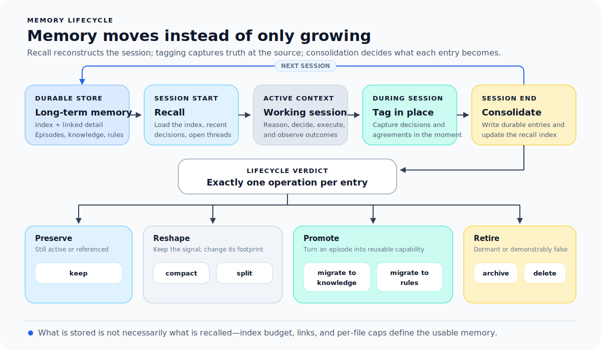
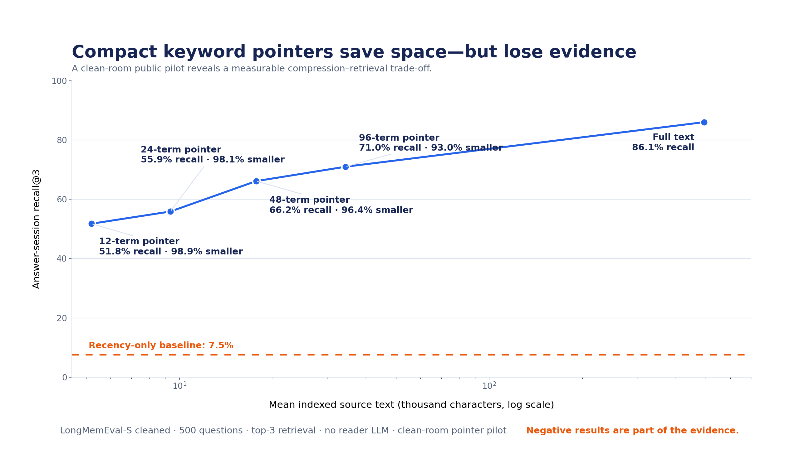
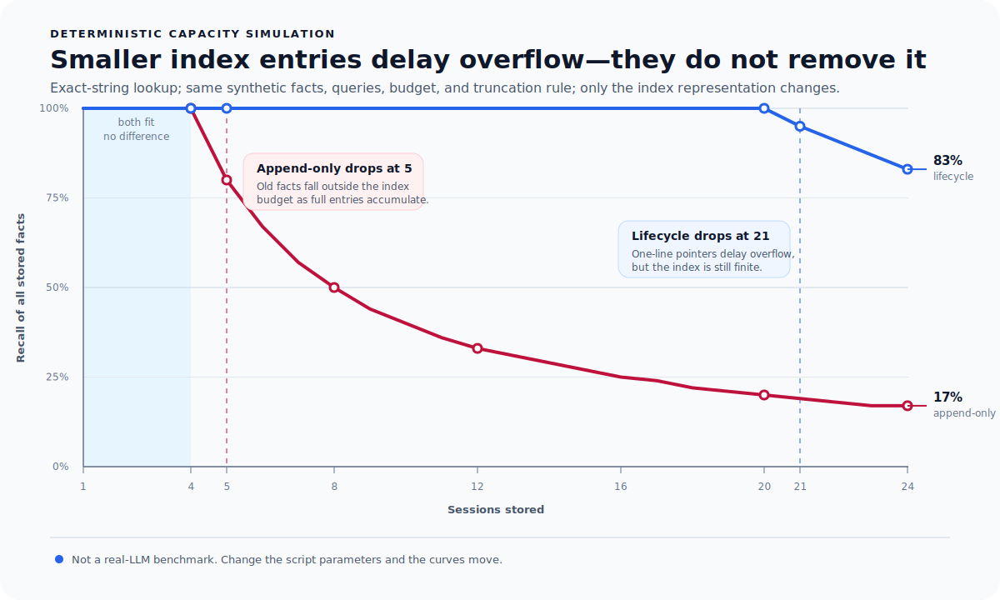
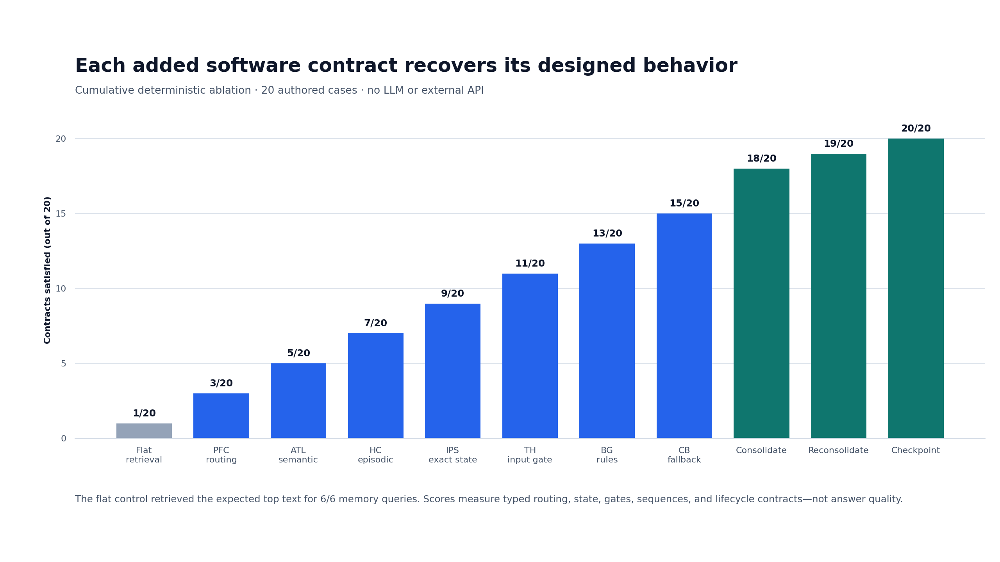

[English](README.md) | **한국어**

# Brain-AI Memory — 프로젝트를 매번 다시 설명하지 마세요

**새 Codex나 Claude Code 세션을 열어도 지난 작업에서 바로 이어갈 수
있습니다.**

Brain-AI Memory는 사용자가 보존하기로 한 사실, 결정, 정확한 값, 다음 작업을
프로젝트별로 내 컴퓨터에 저장해 다른 작업의 기억과 섞이지 않게 합니다. 세션
자동화를 켜면 다음 세션이 관련 기억과 지난 작업의 인계 내용을 받습니다. 사실이
바뀌면 이전 버전과 출처도 다시 확인할 수 있게 남깁니다. 기존 `MEMORY.md`는 수정하지
않습니다.

**내 컴퓨터에서 실행 · API 키 불필요 · 가입 불필요 · 별도 데이터베이스 설치 불필요**

[](https://github.com/Hahyun-Lee/brain-ai-memory/actions/workflows/ci.yml)
[](https://github.com/Hahyun-Lee/brain-ai-memory/releases/latest)
[](pyproject.toml)
[](LICENSE)

**[60초 체험](#60초-동안-확인하기)** ·
**[MEMORY.md 가져오기](#기존-memorymd-가져오기)** ·
**[Codex·Claude Code 연결](#codex와-claude-code-연결하기)** ·
**[검증 결과](#지금까지-확인한-결과)**

<p align="center">
  
</p>

<p align="center">
  지난 세션 → 지금 프로젝트에 필요한 기억 → 다음 세션에서 이어서 작업.<br>
  선택 기능: 승인한 규칙과 충돌하는 명령을 실행 전에 막습니다.
</p>

> 검색은 비슷한 예전 기록을 찾습니다. Brain-AI Memory는 그 기록이 어느
> 프로젝트의 것인지, 더 최신 사실로 교체됐는지, 다음 세션에서 무엇을 이어야
> 하는지도 함께 관리합니다.

## 60초 동안 확인하기

저장소에서 설치한 뒤, 실제 메모리 파일을 건드리기 전에 임시 디렉터리에서 tour를
실행해 보세요.

```bash
git clone https://github.com/Hahyun-Lee/brain-ai-memory.git
cd brain-ai-memory
python3 -m venv .venv
source .venv/bin/activate
python -m pip install .
```

```bash
DEMO_HOME="$(mktemp -d)"
brain-ai --home "$DEMO_HOME" tour
```

```text
Brain-AI Memory: current memory and a session handoff
1  BIND     Atlas 2.1 → belongs_to → Atlas
2  RECALL   Atlas 2.1 release day is Thursday.
3  STATE    open_reviews = 3
4  UPDATE   Friday → superseded by → Thursday
5  HANDOFF  checkpoint handoff_...
Optional action checks
6  GUARD    blocked: release approval is required before production deployment
7  FALLBACK completed after 2 attempts
```

이 tour는 로컬 패키지가 실행됨을 확인할 뿐, 사용자 파일을 가져오거나
에이전트가 메모리를 자율적으로 사용한다는 뜻은 아닙니다.

**검증 범위:** 전체 123개 테스트는 Python 3.12에서 실행하며, 핵심
runtime과 adoption workflow는 Python 3.10·3.11에서도 확인합니다. Clean wheel의
실제 process 재시작·resume, subprocess host hook 설정, 자동 checkpoint·resume,
component contract 20/20을 검증했습니다. 이는 설치·통합 근거이며 더 나은 LLM
답변을 입증한 결과는 아닙니다.

## 이런 경우에 쓰세요

다음 세 조건이 모두 맞을 때 유용합니다.

1. 작업이 여러 세션에 걸쳐 이어진다.
2. 사실, 규칙, 정확한 상태값이 계속 바뀐다.
3. 오래되거나 다른 프로젝트의 기억을 쓰면 실제 실수가 생긴다.

대표적인 사용자는 여러 프로젝트를 오가는 코딩 에이전트, 수개월간 실험과 원고를
이어 가는 연구 워크플로, 티켓·승인·배포 상태를 관리하는 운영 에이전트, Codex와
Claude Code에서 여러 하위 에이전트를 함께 쓰는 개발자입니다.

한 번 끝나는 대화, 하나의 저장소에서 짧게 하는 작업, 일반 문서 검색, 사람이
가끔 `MEMORY.md`를 정리하면 충분한 경우에는 필요하지 않을 가능성이 큽니다.

기본 검색은 로컬 SQLite 기록을 대상으로 한 다국어 BM25이며 embedding model을
내려받지 않습니다. Vault·Smart Connections 연동은 선택 사항입니다. 수동 호출
모드는 호스트의 요청을 기다립니다. 선택형 자동 모드는 사용자 요청을 같은
프로젝트의 기록을 고르는 데만 쓰고, 제한된 문맥을 전달하며, 원본 대화를 저장하지
않은 채 관찰된 변경의 체크포인트를 남깁니다.

## 기존 MEMORY.md 가져오기

위 tour를 실행하지 않았다면 저장소에서 기본 패키지를 설치합니다.

```bash
git clone https://github.com/Hahyun-Lee/brain-ai-memory.git
cd brain-ai-memory
python3 -m venv .venv
source .venv/bin/activate
python -m pip install .
```

가져올 메모리 파일이 있는 프로젝트로 이동합니다. 아래 명령은 프로젝트 경로와
로컬 저장 위치를 고정하고, 모든 기록을 `my-project`라는 하나의 프로젝트에 묶습니다.

```bash
cd /path/to/your/project
export PROJECT_ROOT="$PWD"
export BRAIN_AI_HOME="$PROJECT_ROOT/.brain-ai"
brain-ai audit MEMORY.md --entity my-project
```

```text
Audited /path/to/MEMORY.md
Entity: my-project
Entries: 84

Ready to import:       63
Needs review:          13
Duplicate candidates:  8
Possible conflicts:     3

Review plan: /path/to/your/project/.brain-ai/workflows/audits/audit_0123456789abcdef.json
Source file and memory store unchanged.
Next: brain-ai --home /path/to/your/project/.brain-ai review audit_0123456789abcdef
```

원문 줄 위치와 함께 항목을 확인하고, 판단이 분명한 항목만 승인한 뒤 저장된
review를 적용합니다.

```bash
brain-ai review audit_0123456789abcdef
brain-ai review audit_0123456789abcdef --approve-ready
brain-ai apply review_0123456789abcdef --yes
```

`--approve-ready`는 일반 지식·사건 항목을 승인하고 완전히 같은 중복 후보는
건너뜁니다. 정확한 상태값과 실행 규칙 후보는 미해결로 남습니다. Audit는 어떤
사실이 이전 사실을 대체하는지 추측하지 않으므로, 그런 의도라면 해당 항목의 결정을
명시적인 `--supersede`로 덮어써야 합니다. Apply는 선택한 Brain-AI home만 변경하며
`MEMORY.md`를 수정하지 않습니다.
Project-scoped supersession은 old record가 같은 project에 이미 연결된 경우에만
허용하며 global memory나 다른 project의 memory를 비활성화하지 않습니다.

현재 디렉터리에 `.claude/MEMORY.md` 또는 `MEMORY.md`가 있으면 경로를 생략할 수
있습니다. 홈 디렉터리나 제공자 로그를 임의로 탐색하지 않습니다. 점검 결과도
저장하지 않은 순수 미리보기가 필요하면 `brain-ai audit ... --no-save`를 사용하세요.

로컬 저장소에는 일반 SQLite·JSON·JSONL 파일이 생깁니다. 이 패키지가
암호화하지 않으므로 `.brain-ai/`를 공개 저장소에 commit하지 말고, 기록의
민감도에 맞게 접근 권한과 백업을 관리해야 합니다.

## Audit가 판단하는 것과 판단하지 않는 것

Audit는 Markdown을 실행하지 않고 읽으며, 각 항목에 원본 경로, 줄 범위, 내용
hash를 붙입니다. 정규화했을 때 완전히 같은 항목을 중복 후보로, 같은 명시적 key에
서로 다른 literal value가 있으면 충돌 후보로 표시합니다. 이는 검토할 지점을
알려 줄 뿐, 어느 문장이 참이거나 현재 사실이라는 판정이 아닙니다.

| 검토 결과 | 승인 방법 |
|---|---|
| 일반 지식 또는 사건 | `--approve-ready`, 또는 `--set ITEM=semantic\|episodic` |
| 정확한 상태값 | `key: value` 형식 항목에 `--set ITEM=state` |
| 실행 규칙 | `--rule ITEM=SAFE_PATTERN`과 `--rule-effect warn\|block` |
| 이전 사실을 대체하는 기록 | `--supersede ITEM=MEMORY_ID` |
| 가져오지 않을 기록 | `--set ITEM=skip`, 또는 완전히 같은 중복 후보의 자동 skip |

기록의 날짜, 문장 표현, 파일 순서만으로 진실이나 오래됨을 추론하지 않습니다.
첫 apply가 성공하기 전에 원본 파일이나 typed store가 바뀌면 operation을 중단하고
다시 audit하도록 안내합니다. 이미 완료한 review를 다시 적용하면 중복 변경 없이
종료하고 receipt에 이후 source 변경 여부를 표시합니다.

적용한 batch는 명시적으로 rollback할 수 있습니다.

```bash
brain-ai rollback batch_0123456789ab --yes
```

Rollback은 안전하게 복구할 수 있는 이전 활성 상태를 복원합니다. 물리적 삭제는
아닙니다. 원본 파일, import receipt, 출처 근거는 남습니다.
Fresh audit·review로 같은 source를 다시 import할 수 있고 두 attempt가 모두
ledger에 남습니다.

## Codex와 Claude Code 연결하기

새 세션에서 같은 프로젝트의 기억을 자동으로 불러오고, 관련 변경이 있는 작업이
끝날 때 다음 세션을 위한 체크포인트를 남기려면 자동 모드를 사용하세요. 실제
파일을 바꾸기 전에 명령이 변경 내용을 먼저 보여 줍니다.

```bash
# 내려받은 brain-ai-memory 저장소에서 자동 세션 기능 설치
cd /path/to/brain-ai-memory
python -m pip install ".[mcp]"

# 그다음 이 기억을 사용할 프로젝트에서 한 번 실행
cd /path/to/your/project
export PROJECT_ROOT="$PWD"
export BRAIN_AI_HOME="$PROJECT_ROOT/.brain-ai"
brain-ai init
brain-ai entity add --name my-project --type project  # 이미 있으면 생략

# Codex: 미리보기, 적용, 이 프로젝트에서 새 Codex 세션 시작
brain-ai connect codex --entity my-project --mode loop --project-root "$PROJECT_ROOT"
brain-ai connect codex --entity my-project --mode loop --project-root "$PROJECT_ROOT" --apply
brain-ai doctor --host codex --entity my-project --mode loop --project-root "$PROJECT_ROOT"
```

Claude Code에서는 `codex`를 `claude-code`로 바꾸면 됩니다. 기존 `MEMORY.md`를
가져왔다면 project entity는 이미 생성되어 있습니다. Codex에서는 `/hooks`로 이
프로젝트에 추가된 hook을 확인하고 신뢰한 뒤 새 세션을 시작하세요. `doctor`는
설치 직후 `configured`, 실제 start → prompt → stop이 한 번 관찰된 뒤 `active`로
표시합니다.

Automatic mode는 프로젝트 하나에만 연결됩니다. 세션 시작 시 최근 인계 내용과
현재 기록을 정해진 최대 크기 안에서 가져오고, prompt는 같은 프로젝트의 관련
기록을 고르는 동안에만 사용합니다. 원본 prompt, tool 출력, assistant 답변, 수정한
파일 내용은 저장하지 않으며, 문장을 사실·규칙·정확한 상태값으로 임의 승격하지
않습니다. 전체 event 흐름, privacy 경계, host 차이, 제거 방법은
[자동 세션 메모리](docs/08-autonomous-loop.ko.md)에 정리했습니다.

필요할 때 agent가 직접 memory tool을 호출하게 하려면 `--mode loop`를 빼세요.

```bash
brain-ai connect codex --entity my-project --project-root "$PROJECT_ROOT"
brain-ai connect codex --entity my-project --project-root "$PROJECT_ROOT" --apply
```

Tools-only mode에서는 Codex나 Claude Code가 recall·저장·checkpoint 시점을
결정합니다. `--scope user`는 이 의도적인 tools-only 연결에서만 사용할 수
있습니다. `brain-ai disconnect ...`도 먼저 diff를 보여 주고 `--apply`가 있어야
설정을 바꿉니다.

Preview에는 managed `brain-ai-memory` entry의 sanitize된 view만 나옵니다. 예상하지
않은 environment data는 redact하고 관계없는 host config는 출력하지 않습니다.
Disconnect는 같은 scope/project config와 Brain-AI home에서 이 command가 소유한
entry만 제거하며, `--entity`를 전달했다면 기존 값과도 일치해야 합니다. 직접 작성한
연결 entry는 이 command의 관리 대상이 아니므로 직접 수정하거나 제거해야 합니다.

생성되는 project entry는 활성화된 shell 밖에서도 같은 설치본을 실행하도록 현재
Python interpreter와 Brain-AI home의 절대 경로를 기록합니다. Host config를
commit하거나 공유하기 전에는 이 machine-local 경로를 반드시 확인하세요.

생성된 연결은 모든 memory 호출을 선택한 프로젝트에 고정합니다. 다른 프로젝트를
명시적으로 읽거나 쓰려는 요청은 범위를 조용히 바꾸지 않고 거부합니다.

Tools-only mode에서 호스트가 일관된 메모리 흐름을 따르게 하려면 프로젝트의
`AGENTS.md`나 `CLAUDE.md`에 다음과 같은 지시문을 추가하세요.

```text
세션을 넘는 작업에서는 brain_resume을 먼저 호출하고 project fact를 쓰기 전에
brain_context를 호출한다. 오래 보존할 결정·사건·바뀐 상태만 brain_remember로
저장한다. 다음 세션에 넘기기 전에 짧은 summary와 구체적인 next_actions를 넣어
brain_checkpoint를 호출한다.
```

## 세션 인계와 재개

세션을 마칠 때 합의된 요약과 구체적인 다음 행동을 남깁니다. 다음 세션은 같은
entity의 가장 최근 인계만 읽습니다.

```bash
brain-ai handoff --entity my-project \
  --summary "release review 완료; 목요일이 승인된 배포일" \
  --next "staging 배포 실행"
brain-ai resume --entity my-project
```

연결된 agent는 같은 흐름을 `brain_checkpoint`와 `brain_resume`로 실행할 수
있습니다. 프로젝트 연결 설정이 기본 entity를 넘겨줍니다.
첫 handoff 전에는 `resume`/`brain_resume`이 빈 summary와 `next_actions`를 포함한
`status: not_found`를 반환합니다. 이는 정상적인 첫 실행 결과입니다.

## 적용하면 무엇이 달라지나?

| 겪고 있는 문제 | Brain-AI Memory가 하는 일 |
|---|---|
| 기존 `MEMORY.md`에 지식·사건·규칙·상태값이 섞임 | 원문 위치가 남는 audit, 명시적 review, import receipt |
| 두 프로젝트나 릴리스의 기억이 섞임 | 한 대상에 묶인 기록은 다른 대상에서 제외함. 의도적으로 대상이 없는 기록은 공통으로 공유됨 |
| 검토한 새 사실이 이전 사실을 대체함 | 선택한 프로젝트의 active view에서 이전 기록을 빼되 출처 이력과 다른 프로젝트 연결은 보존함 |
| 이미 저장한 값을 모델이 다시 추측함 | 문장과 분리된 상태 저장소에서 정확한 값을 읽음 |
| 반복된 경험이 세션 로그에 묻힘 | 미리 확인한 뒤 지식이나 규칙으로 승격함 |
| 다음 세션이 이전 결정을 모른 채 시작함 | 프로젝트 범위의 요약과 남은 작업을 인계함 |

여러 세션에 걸쳐 일하는 코딩·연구·운영·비서 에이전트를 만들고 있다면 사용할
수 있습니다. RAG가 관련 문서를 찾은 뒤에도 프로젝트가 섞이거나, 오래된 사실이
나오거나, 정확한 상태값을 잃는 경우에도 맞습니다. 일회성 대화나 일반 문서
검색에는 RAG만 쓰는 편이 더 단순합니다.

제공자와 무관한 수동 MCP 설정은 [MCP 안내](docs/07-mcp-server.ko.md)를
참고하세요. [CLI와 Python 사용법](docs/05-runtime.ko.md)부터 시작해도 됩니다.
[필요한 부분부터 적용](#어디서-시작하면-되나)하거나 [검증 결과](#지금까지-확인한-결과)를
더 살펴볼 수 있습니다.

## 어떤 기억을 어떻게 관리하나

| 관리 대상 | 현재 source가 하는 일 |
|---|---|
| 기존 Markdown 메모리 | 원본 파일을 바꾸지 않고 줄 단위 출처와 함께 audit·review·import |
| 선별한 기록 | 명시적인 memory write를 저장하며, automatic mode에서는 제한된 상대 edit 대상 정보만 추가하고 파일 내용과 원본 대화는 저장하지 않음 |
| 다음 호출에 쓸 문맥 | 대상 범위에 맞춰 묶으며, automatic mode에서는 source ID를 포함한 전체 문맥을 6,000 byte 이하로 제한 |
| 일화 기억 | 저장 시각이 붙은 사건, 대상 연결, 보존된 import 근거를 기록 |
| 의미 기억 | 출처가 있는 지식을 저장하고, 명시적으로 대체한 이전 사실은 이력으로 보존 |
| 절차 기억 | 규칙을 저장하고, 먼저 확인하고 승인한 사건만 지식이나 규칙 후보로 승격 |
| 정확한 상태값 | 이미 아는 값을 모델이 다시 추측하지 않도록 형식 있는 저장소에 보관 |
| 수명 주기와 세션 인계 | 통합, 재통합, 활성·비활성 결정, rollback 근거, handoff·resume, 변경이 있을 때만 쓰는 중복 방지 automatic checkpoint |
| 호스트 연결 | 선택한 프로젝트에 고정된 연결을 미리 보고 적용하며, 선택형 hook이 recall·행동 검사·인계 확인·checkpoint 시점을 자동화 |

대상 간 관계와 출처 표시는 모든 저장소에 공통으로 적용됩니다. 런타임을 시작할
때 구성 요소 스키마도 검증합니다. Tools-only mode는 provider session을 수집하거나
메모리를 model context에 자동으로 넣지 않습니다. Automatic mode는 prompt를
검색하는 동안에만 사용하며 원본 prompt, tool 출력, assistant 답변, 수정한 파일
내용은 저장하지 않습니다. 파일 압축·분할과 원문 삭제는 host가 맡습니다. CLI의
`limit`은 기록 수를, automatic context path는 byte 수를 제한합니다.

## 기억을 직접 저장하고 조회하기

Adoption workflow는 프로젝트 entity를 만듭니다. 필요하면 entity와 기록을 직접
만들어도 됩니다.

```bash
brain-ai entity add --name "Atlas" --type project --alias A
brain-ai remember --type episodic --entity Atlas \
  --text "배포일이 목요일로 변경됐다" --promote semantic
brain-ai remember --type state --entity Atlas --key open_reviews --value 3
brain-ai run --entity Atlas \
  "최근 무엇이 바뀌었고 review가 몇 개 남았나?"
brain-ai consolidate          # preview
brain-ai consolidate --apply  # 명시적 승격
brain-ai handoff --entity Atlas --summary "release review 완료"
```

런타임을 시작하면 구성 요소 스키마를 검증합니다. `brain-ai ontology`로 결과를
확인할 수 있으며 기준 스키마는
[`schema/brain_components.yaml`](schema/brain_components.yaml)입니다.

### 행동 검사 연결하기 (선택)

Tools-only mode의 `brain_check_action`은 제안된 동작을 확인할 뿐 shell 명령을
실행하지 않으므로 host가 `gate.allowed = false`를 중단 조건으로 사용해야 합니다.
Automatic mode는 project rule을 지원되는 Bash 실행 전 hook에 연결하고 block rule이
맞으면 host에 거부 결과를 돌려줍니다. 이는 좁고 명시적인 command 경계이며 모든
tool이나 부수 효과를 가로챈다는 뜻은 아닙니다. 실행 경로를 완전히 명시하려면
`brain-ai harness`를 사용하세요. 자세한 내용은 [자동 세션
메모리](docs/08-autonomous-loop.ko.md)와 [수동 연결
안내](docs/07-mcp-server.ko.md)를 참고하세요.

## 왜 뇌의 기능 분화에서 착안했나?

뇌 비유는 생물학적 주장이 아니라 설계를 돕는 도구입니다. 사건, 사실, 규칙,
정확한 상태값, 실행 전 검사를 나눠 두면 실패 원인을 따로 확인할 수 있습니다.
뇌 영역 이름이 필요 없다면 기능 계약만 사용해도 됩니다. 자세한 내용은
[뇌 기능과 소프트웨어의 대응 관계](docs/01-the-mapping.md)에 정리했습니다.

현재 test suite는 adoption workflow 40개, runtime 27개, ablation 5개, packaged
재시작·resume 1개, host integration 17개, automatic loop 29개, storage
내구성·동시성 4개(총 123개)를 확인합니다. 아직 RAG나
더 단순한 메모리보다 실제 LLM 답변이 좋아진다고 말할 단계는 아닙니다.
[검증 결과와 한계](#지금까지-확인한-결과)를 함께 공개합니다.

## 지금 겪는 문제부터 확인하기

여러 세션 동안 코딩, 연구, 운영, 비서 작업을 이어 가는 에이전트를 만들고 있다면
아래 상황이 익숙할 수 있습니다.

- 분명 기록했는데 다음 세션에서 이어서 쓰지 못한다.
- 검색된 노트는 관련 있지만 이미 바뀐 내용이다.
- 사건이 다른 프로젝트나 대상에 잘못 연결됐다.
- 같은 교훈을 반복해서 얻었지만 재사용할 지식으로 정리되지 않았다.
- 정확한 값이 저장돼 있는데도 모델이 문맥만 보고 다시 추측한다.
- 메모리 인덱스만 커지고 무엇을 남기거나 옮기고 보관할지 기준이 없다.

지속 상태가 없는 단일 턴 챗봇에는 이 아키텍처가 필요하지 않을 가능성이
큽니다. 문제가 일반적인 문서 검색뿐인 워크플로에도 필요하지 않습니다. 이미
겪고 있는 실패부터 시작하세요. 전체 아키텍처를 한꺼번에 채택할 필요는 없습니다.

| 관찰한 문제 | 먼저 확인할 곳 | 가장 작게 바꾸는 방법 |
|---|---|---|
| 확정된 문맥이 사라지거나 잘못된 사건에 연결됨 | 일화 기억(HC) | 저장 시각이 붙은 사건을 대상에 연결 |
| 한 프로젝트의 기억이 다른 프로젝트로 샘 | 대상 범위와 관계 | 기록을 고정된 대상에 묶고 그 범위 안에서 검색 |
| 검색 결과는 관련 있지만 오래됨 | 의미 기억(ATL) | 최신 여부를 확인하고 충돌하면 새 버전으로 교체 |
| 반복된 사건이 재사용할 지식이나 절차가 되지 않음 | consolidation | 승격 전에 내용을 확인하고 승인 |
| 이전 사실과 새 사실이 모두 현재 기록으로 남음 | reconsolidation | 이전 기록과 출처는 남기고 새 기록만 활성화 |
| 정확히 알 수 있는 수치를 추측함 | 수치 상태(IPS) | 정확한 상태값 저장소에서 조회 |
| 항상 읽는 인덱스가 계속 커짐 | 메모리 수명 주기 | 크기를 제한하고 보관·이동 결정을 기록 |
| 다음 세션이 이전 결정을 이어가지 못함 | 체크포인트와 세션 인계 | 범위가 정해진 요약과 아직 정리할 항목을 보존 |

이 구분은 여러 프로젝트를 오가는 에이전트를 실제로 운영하며 메모리, 검색,
수명 주기, 세션 인계 문제를 디버깅하는 과정에서 생겼습니다. 아래에서는 운영
기록과 벤치마크 결과를 나눠 제시합니다.

### 기억을 행동에 연결할 때 생기는 문제

메모리의 범위와 현재 상태를 바로잡은 뒤에는 선택 기능인 행동 검사가 다른
종류의 실패를 다룰 수 있습니다.

| 관찰한 문제 | 관련 구성 요소 | 가장 작게 바꾸는 방법 |
|---|---|---|
| 불러온 규칙이 실행 단계에서 무시됨 | 절차 규칙 사용(BG) | 저장한 규칙을 실행 전 행동 검사에 연결 |
| fallback 순서가 첫 실패 뒤 중단됨 | 절차 실행(CB) | 순서를 실행 가능한 harness로 옮김 |
| 올바른 기억 묶음이 위험한 행동으로 이어짐 | routing과 행동 검사(PFC/TH) | 호스트가 실행 직전에 검사 결과를 중단 조건으로 사용 |

## RAG·hook·harness와 무엇이 다른가

RAG는 관련 문장을 찾습니다. Brain-AI Memory는 그 결과가 어떤 종류의 기록인지,
어느 대상에 속하는지, 지금도 유효한지, 지식이나 규칙으로 남길지, 다음 세션에
무엇을 넘길지까지 관리합니다. 검색은 그 과정의 한 단계입니다.

| 기존 방법 | 잘하는 일 | 따로 관리해야 할 것 |
|---|---|---|
| 긴 컨텍스트 또는 메모리 파일 | 모델이 지금 읽을 문장을 제공 | 기록 유형, 대상 범위, 현재 버전, 승격, 보존, 세션 인계 |
| RAG 또는 벡터 저장소 | 질문과 관련된 후보 문장을 검색 | 대상 연결, 최신성, 정확한 상태값, 통합, 변경 이력, 출처 |
| 엔터티 모델, 온톨로지, 관계형·그래프 DB | 대상과 구조화된 관계를 표현 | 기록이 사건·지식·규칙·상태값 중 무엇이며 세션 사이에 어떻게 바뀌는지 |
| hook, guard, harness, retry loop | 호출 가로채기, 실행 정책, 절차 실행, 재시도 | 이 기능들이 읽고 쓰는 메모리의 소유권과 수명 주기 |
| Brain-AI Memory | 유형별 로컬 저장소, 대상 범위, 현재 기록 조회, 승격·갱신, 감사 기록, 세션 인계 | 원본 수집, 모델 문맥 구성, 일정 관리, 물리적 보존, 운영 정책은 호스트가 담당 |

엔터티와 관계는 대상을 식별하고 조회 범위를 나누는 데 씁니다. 도메인 온톨로지
추론기나 운영 데이터베이스를 대신하지는 않습니다. RAG는 의미 검색을 맡고,
hook은 이 패키지를 호출하며, harness는 절차 기억을 실행할 수 있습니다.
Brain-AI Memory는 이들 사이에서 기록의 소유권과 수명 주기를 관리합니다.

### 실행 제어 기능의 역할

Hook은 호출 지점이고, guard는 허용·경고·차단을 결정합니다. Harness는 실행
순서를 맡고, loop는 결과를 다음 시도에 반영합니다. 이 저장소에도 작은 guard와
fallback 예제가 들어 있지만, 실제 차단과 실행은 호스트가 맡습니다. 메모리
관리와 행동 검사는 코드와 테스트에서도 따로 다룹니다.

### 이 저장소가 새로 묶어 낸 것

기억 유형, RAG, 엔터티 모델, hook, workflow harness, 평가, 압축은 모두 기존에
있던 개념입니다. 이 저장소는 서로 다른 실패를 모두 검색 문제로 뭉개지 않고,
각 기능을 설치 가능한 하나의 동작 규약으로 연결합니다.

- PFC는 작업 기억 후보를 구성하고, HC는 사건과 관계를 기록합니다. ATL은 출처가
  있는 지식을, BG는 절차 규칙을, IPS는 정확한 상태값을 보존합니다.
- CB는 실행 절차를 규칙과 분리합니다. 현재 버전은 호스트가 넘긴 fallback 단계를
  실행하며, 전체 절차 목록은 호스트가 관리합니다.
- Consolidation은 사건을 지식이나 규칙으로 올리기 전에 내용을 보여줍니다.
  Reconsolidation은 오래된 사실을 덮어쓰지 않고 출처가 있는 새 버전을 만듭니다.
- 각 기록에는 유지, 압축, 보관, 지식·규칙으로 이동, 삭제, 분할 중 하나의 수명
  주기 결정을 남길 수 있습니다. 현재 버전은 이 결정과 활성 상태를 기록합니다.
- Entity별 handoff에는 기록 수, 아직 정리할 후보, 호스트가 쓴 요약과 다음 행동이
  들어가며, resume은 같은 entity의 최신 handoff를 읽습니다.
- TH/BG/CB 행동 검사 경로는 핵심 메모리 경로와 별도로 테스트합니다.

뇌 기능 이름은 설계를 설명하기 위한 표지입니다. 실제 가치는 기능별 동작 규약과
실패 검사에 있습니다. 현재 결과는 운영 경험, 검색의 장단점, 소프트웨어 동작을
보여줍니다. 더 단순한 메모리보다 실제 답변이 좋아지는지는 아직 검증 중입니다.

## 어디서 시작하면 되나

이미 쓰는 메모리 파일이나 실제 문제부터 시작하세요. `brain-ai tour`는 synthetic
동작 확인용으로 계속 제공하지만 adoption에 필수는 아닙니다. 행동 검사는 필요할
때만 추가하세요.

| 확인할 목표 | 시작할 곳 | 잘 됐는지 확인하는 방법 |
|---|---|---|
| 기존 Markdown 메모리 가져오기 | `audit` → `review --approve-ready` → `apply --yes` | 승인한 기록에는 원문 줄과 hash가 남고 `MEMORY.md`는 바뀌지 않음 |
| synthetic data로 kernel 확인 | `brain-ai tour` | `.brain-ai/`에서 대상 연결, 현재 사실, 상태값, 변경 이력, handoff 확인 |
| 에이전트에 기억 유형별 저장소 추가 | [`brain-ai` 런타임](docs/05-runtime.ko.md)의 `entity`, `remember`, `run` | 서로 묶인 기록은 섞이지 않고, 의도적인 global 기록만 공통으로 반환 |
| 가져온 상태값·규칙·대체 기록을 명시적으로 처리 | `review --set`, `--rule`, `--supersede` | 기록된 선택 없이 state, 실행 규칙, 이전 version이 바뀌지 않음 |
| Obsidian / Smart Connections 연결 | [검색 어댑터](docs/06-adapters-and-observer.ko.md) | v1·v2 응답을 처리하며, entity 연결이 없는 vault 결과는 local import·link 전까지 scoped recall에서 제외 |
| 로컬 상태와 세션 인계 확인 | [읽기 전용 뷰어](docs/06-adapters-and-observer.ko.md#read-only-reference-observer) | localhost에서 저장소 개수, 최근 감사 기록, 마지막 체크포인트 확인 |
| Codex·Claude Code 세션 사이를 자동으로 이어서 작업 | `brain-ai connect codex\|claude-code --entity ... --mode loop` | 실제 start → prompt → stop 뒤 `doctor`가 active가 되고 다음 start가 같은 범위의 checkpoint를 resume |
| Codex나 Claude Code에 범위가 정해진 메모리 연결 | `brain-ai connect codex\|claude-code --entity ...` | 프로젝트 설정이 같은 store와 의도한 기본 entity를 가리킴 |
| 다른 MCP 호스트 연결 | [수동 MCP 안내](docs/07-mcp-server.ko.md) | 호스트가 `brain_context`를 호출하고 결과를 기록하며 해당 범위의 handoff를 재개 |
| 실행 전에 저장된 절차 규칙 적용 | `brain-ai harness --entity ...` 또는 [행동 가드](templates/hooks/behavioral-guard.py) | 특정 대상에 속한 위험 패턴이 실제 실행 직전에 차단 |
| 호스트가 정한 대체 절차 실행 | `brain-ai sequence --entity ...` | 성공·차단·모든 시도 소진 중 하나에 닿을 때까지 실행 기록이 이어짐 |
| 인덱스가 두 번째 원본 저장소가 되는 것 방지 | [메모리 템플릿](templates/memory/MEMORY.skeleton.md) | 주제당 한 줄의 링크만 항상 로드 |
| 무엇을 유지·이동·보관할지 결정 | [7가지 결정 도구](templates/memory/7-op-decision.md) | 검토한 기록마다 하나의 결정이 남고, 파일을 실제로 바꾸는 일은 호스트가 한다는 경계 확인 |
| 채택 전에 아키텍처 평가 | [설계 맵](docs/01-the-mapping.md)과 [검증 자료](evidence/README.md) | 실제 실패를 해당 구성 요소로 설명할 수 있는지, 예외는 무엇인지 확인 |

Hook은 Python 표준 라이브러리만으로 self-test할 수 있습니다.

```bash
python3 templates/hooks/behavioral-guard.py --selftest
python3 templates/hooks/self-check-trigger.py --selftest
```

## 구성 요소와 역할

기준 맵에는 일곱 구성 요소가 있습니다. PFC·HC·ATL·BG·CB는 작업 기억, 일화,
지식, 규칙, 실행 절차를 나눠 맡습니다. TH는 행동을 검사하고 IPS는 정확한 수치를
보관합니다. Consolidation과 reconsolidation은 구성 요소 사이에서 기억을 옮기고
갱신하는 경로입니다. 뇌과학 근거와 한계는 [상세
매핑](docs/01-the-mapping.md)을 참고하세요.

| 구분 | 구성 요소 | 현재 패키지가 맡는 일 | 확인할 수 있는 문제 |
|---|---|---|---|
| 기억 | PFC | 질문을 알맞은 저장소로 보내고 대상 범위에 맞는 작업 기억 후보를 구성 | 잘못된 저장소나 대상을 선택함 |
| 기억 | HC | 사건, 엔터티, 별칭, 관계, 연결 정보를 기록 | 사건이 없거나 잘못된 맥락에 연결됨 |
| 기억 | ATL | 출처와 변경 이력이 있는 현재 지식을 보관 | 검색 결과가 오래됐거나 출처가 잘못됨 |
| 기억 | BG | 절차 규칙과 승인된 사건의 규칙 승격을 보관 | 재사용할 규칙을 기록하거나 선택하지 못함 |
| 기억 | CB | 호스트가 넘긴 실행 단계를 순서대로 수행 | 절차가 문장으로만 남거나 fallback 도중 멈춤 |
| 계산 | IPS | 대상별 정확한 수치 상태를 보관 | 알 수 있는 수치를 문장에서 추측함 |
| 제어 | TH | 호스트가 제안한 행동을 실행 전에 검사 | 위험한 행동이 도구까지 도달함 |
| 수명 주기 | consolidation | 사건을 지식·규칙으로 올리기 전에 보여주고 요청할 때 적용 | 반복 경험이 재사용할 기억이 되지 않음 |
| 수명 주기 | reconsolidation | 출처가 있는 새 지식 버전을 만들고 선택한 범위의 연결을 교체 | 같은 범위에서 오래된 지식과 현재 지식이 함께 활성화됨 |

TH에서 가져온 더 넓은 개념은 입력 선별입니다. 현재 런타임에서 직접 확인할 수
있는 구현은 실행 전 행동 검사입니다. 모델의 전체 프롬프트를 거르는 기능은
아닙니다.

### 자동으로 하는 일과 검토가 필요한 일

Tools-only mode에서는 recall·저장·handoff 시점을 host가 정합니다. 선택형 automatic
mode는 세션의 결정론적 연결부를 자동화합니다. 시작·prompt 시 제한된 project
recall, 지원되는 Bash 행동 검사, 성공한 edit의 제한된 대상 정보, 변경이 있을
때만 쓰는 checkpoint, resume, 전달 확인이 여기에 해당합니다.

판단이 필요한 memory 변경은 계속 명시적으로 수행합니다.

1. 기존 `MEMORY.md`는 가져오기 전에 사용자가 검토합니다.
2. 사실, 규칙, 정확한 상태값, 이전 사실을 대체하는 새 버전은 명시적인 memory
   operation이 있을 때만 기록합니다.
3. 실제 작업의 판단과 실행은 host가 맡으며, loop는 tool 출력이나 assistant 문장에서
   결과를 임의 추론하지 않습니다.
4. 승격, supersession, 보관, 분할, 압축, 이동, 논리 삭제는 검토 가능한 lifecycle
   결정으로 남습니다.
5. Provider 원본 대화, 실제 파일 보존, 암호화, 백업, 검증된 삭제는 host나 운영자가
   맡습니다.

설치된 흐름은 [자동 세션 메모리](docs/08-autonomous-loop.ko.md), 기록과 인계
contract는 [메모리 수명 주기](docs/02-memory-lifecycle.ko.md)를 참고하세요.



## 지금까지 확인한 결과

근거는 실제 운영 기록, 메모리 검색 평가, 소프트웨어 동작 검증, 아직 확인하지
못한 항목으로 나눴습니다. 서로 답하는 질문이 달라 한 점수로 합치지 않았습니다.

운영 수치는 이 공개 저장소보다 먼저 사용한 비공개 원본 시스템에서 나왔습니다.
데모, 테스트, ablation 결과는 현재 공개 패키지에서 나왔습니다.

| 질문 | 현재 근거 |
|---|---|
| 실제로 구현해 사용했는가? | **예. 2026-04-20부터 13개 project memory index에서 운영** |
| 충분한 운영 노출이 있었는가? | **예. 2026-06-10부터 2026-07-14까지 계측 세션 419개, 63.6M tokens** |
| 내부 pointer에서 semantic retrieval이 live grep control보다 나은가? | **시사적 aggregate-only 결과. HIT@10 69.0% → 88.8%, n=116** |
| 동일 budget에서 graph augmentation이 semantic store를 개선하는가? | **시사적 aggregate-only 결과. HIT@10 86.2% → 91.9%, n=690 sources** |
| 공개 benchmark에서 stack-aligned retrieval을 비교했는가? | **공개 LoCoMo data의 aggregate-only 결과. HIT@10: GTE 62.1%, BM25 57.0%, graph-lite 51.9%; answerable questions n=1,531** |
| compact pointer index가 full append-only entry보다 더 많이 들어가는가? | **예. 결정론적 capacity simulation** |
| 단순 compact pointer가 공개 데이터에서 retrieval quality를 보존하는가? | **아니요. 현재 keyword pointer는 recall과 size를 교환함** |
| 설치한 workflow가 MCP process 재시작 뒤에도 이어지는가? | **예. CI에서 clean wheel의 audit → review → apply → 생성된 설정 → 실제 stdio MCP 호출 → checkpoint → 새 process → resume을 실행함. 설치·통합 근거이며 host behavior나 answer quality 근거는 아님.** |
| 설치한 automatic loop가 recall·checkpoint·resume을 이어 가는가? | **Clean-wheel subprocess fixture에서는 예. Codex·Claude Code 설정을 확인하고 Codex start → prompt → edit → stop → 새 start가 같은 project handoff를 resume함. 실제 host 장기 운영 평가는 아직 없음.** |
| lifecycle이 실제 LLM agent의 answer accuracy를 개선하는가? | **아직 측정하지 않음** |
| 전체 아키텍처가 RAG, long context 또는 다른 memory system보다 나은가? | **아직 측정하지 않음** |
| latency, token cost, conflict resolution, abstention이 개선되는가? | **아직 측정하지 않음** |
| single-owner multi-project deployment가 얼마나 일반화되는가? | **알 수 없음. 다기관 반복 검증 없음** |
| Ablation한 열 가지 memory/lifecycle·optional-control mechanism이 작성된 contract를 실행하는가? | **Supporting conformance만 해당. all-ten condition 20/20, flat retrieval control 1/20. Flat control도 memory query 6/6에서 예상 top text를 찾음** |

### 원본 시스템의 운영 기록

2026-07-14 sanitized snapshot은 약 12주간의 시스템 진화를 포함합니다. 실제
운영 환경에는 project memory index 13개, memory file 134개, semantic note
783개, decision/issue ledger record 455개, 계측된 policy event 3,286개가
있습니다. 예약된 recall snapshot 9회에서 각각 18~21개의 stable probe를
실행했습니다. Any-store pass rate는 100%였지만 vector-only probe rate는
33.3%에서 100% 사이로 변동했습니다.

이 수치는 실제 사용, 규모, 모니터링, 반복된 개입을 보여줍니다. 그러나 memory가
419개 session을 유발했다거나, 모든 policy event가 harm을 막았다거나, curated
probe 성공이 end-to-end answer quality와 같다는 뜻은 아닙니다.
[운영 근거와 한계](evidence/operational-evidence.md)를 읽거나
[machine-readable aggregate snapshot](evidence/operational-snapshot-2026-07-14.json)을
직접 확인할 수 있습니다.

### 운영 환경의 검색 성능 비교

운영 stack의 component를 사용해 같은 corpus에서 두 가지 비교를 수행했습니다.

| 평가 | Control | Test condition | 결과 |
|---|---:|---:|---|
| auto-memory pointer retrieval, n=116 | grep HIT@10 69.0% | production embedding HIT@10 88.8% | grep miss 36개 중 25개 복구 |
| semantic-note retrieval, n=690 sources | embedding HIT@10 86.2%, recall@10 41.0% | equal-budget graph hybrid HIT@10 91.9%, recall@10 48.8% | HIT +5.7 pp, recall +7.8 pp |

이것은 독립적인 공개 benchmark가 아니라 같은 시스템 안에서의 유용한 A/B
signal입니다. Pointer gold set은 양쪽 조건의 절대 점수를 부풀릴 수 있고,
graph 평가는 relevance label과 같은 relationship family를 사용합니다. 투명성을
위해 aggregate result만 공개하며 private source record는 의도적으로 제외했습니다.

이전의 stack-aligned 평가에서는 공개 LoCoMo 10개 sample의 answerable question
1,531개 전체에 대해 retrieval을 실행했습니다. HIT@10에서 parallel/legacy
768-dimensional GTE index는 62.12%, BM25는 56.96%, lightweight graph-PPR은
51.93%였습니다. 이것은 긍정 결과와 부정 결과를 함께 보여줍니다. k=10에서는
embedding baseline이 도움이 됐지만 해당 graph approximation은 그렇지
않았습니다. 측정 대상은 gold-evidence retrieval이지 answer accuracy가 아니며,
raw per-item bundle은 private evaluation environment에서 아직 clean-room 공개되지
않았습니다.

### 공개 데이터 검색 성능 실험

정제된 LongMemEval-S 500문항 전체에서 동일한 top-3 budget으로 최근 session,
full-session BM25, compact keyword pointer를 비교한 retrieval-only pilot을
실행했습니다.



| 조건 | Answer-session recall@3 | 평균 indexed source text |
|---|---:|---:|
| 가장 최근 3개 session | 7.5% | search index 없음 |
| full-session BM25 | **86.1%** | 493,948 chars |
| 48-keyword pointer BM25 | 66.2% | 17,691 chars |
| 96-keyword pointer BM25 | 71.0% | 34,368 chars |

96-keyword pointer는 indexed source text를 93.0% 줄였지만 recall은 15.0
percentage points 낮아졌습니다. 단순 keyword compression만으로는 충분하지
않다는 유용한 negative result입니다. Reader LLM을 사용하지 않았으므로 QA,
reasoning, 전체 아키텍처 성능을 주장하지 않습니다.
[method, 전체 ablation, manifest, raw retrieval record](benchmarks/pilots/longmemeval-s-retrieval-20260714/README.md)를
확인할 수 있습니다.

### 용량 시뮬레이션



[Capacity simulation](evidence/lifecycle_under_budget.py)은 고정 character budget에서
exact string lookup을 수행합니다. 공개된 default에서는 full append-only entry는
session 5에서, one-line pointer는 session 21에서 처음 recall이 감소합니다. 이는
storage-budget mechanism을 보여줄 뿐 semantic retrieval, reasoning quality,
real-agent performance를 측정하지 않습니다.

    python3 evidence/lifecycle_under_budget.py

Falsifier와 한계는 [evidence note](evidence/README.md)를 참고하세요. Release-grade
외부 검증을 위한 사전 등록 비교 protocol은 [benchmarks/](benchmarks/README.md)에
있습니다. Controlled reader-model protocol이 실행되기 전에는 end-to-end QA
result table을 추가하지 않습니다.

### 행동 검사 동작 검증

Memory-performance scoreboard와 별도로 설치 가능한 package를 20개의
deterministic contract case와 21개 condition에서 평가했습니다. 조건은 flat
retrieval control, 10개의 cumulative addition, 10개의 leave-one-out
removal입니다. LLM, 외부 API, 비공개 data, 외부 judge는 사용하지 않았습니다.



All-ten condition은 작성된 contract 20/20을, flat control은 1/20을
충족했습니다. 중요한 점은 flat control도 memory query 6/6에서 예상 top text를
모두 찾았다는 것입니다. 낮은 총점은 text retrieval 실패가 아니라 typed routing,
exact state, gate, fallback sequence, lifecycle contract의 부재를 반영합니다. 각
cumulative addition은 지정된 case를 복구했고, 각 leave-one-out removal은 해당
case를 실패하게 했습니다.

이는 테스트한 열 가지 software responsibility가 서로 구분되고 실행 가능함을
검증합니다. Answer quality, autonomous lifecycle management, RAG 대비 우월성을
측정하지는 않습니다. [Report, raw record 420개, summary,
manifest](benchmarks/pilots/component-ablation-20260715/README.md)를 확인하세요.

## 앞으로 확인해야 할 것

가장 중요한 미확보 evidence는 controlled end-to-end memory-management QA
비교입니다. 같은 reader와 budget에서 agent가 더 안정적으로 retain, retrieve,
update, scope, abstain, resume할 수 있는지를 확인해야 합니다. 다음 release-grade
run은 reader model, prompt, context budget, dataset split, scoring procedure를
고정하고 다음 조건을 비교합니다.

1. external memory 없음
2. append-only 또는 full-history memory
3. summarization/compaction
4. standard retrieval baseline
5. Brain-AI lifecycle reference implementation

주 benchmark는 information extraction, multi-session reasoning, knowledge
update, temporal reasoning, abstention을 검사하는
[LongMemEval](https://github.com/xiaowu0162/LongMemEval)입니다. 후속 평가에서는
retrieval, test-time learning, long-range understanding, conflict resolution을
위해 [MemoryAgentBench](https://github.com/HUST-AI-HYZ/MemoryAgentBench)를
사용할 예정입니다. 더 무거운 workflow/environment memory 평가는
[LongMemEval-V2](https://github.com/xiaowu0162/LongMemEval-V2)에 남겨 둡니다.

완전한 per-item output, cost와 latency report, controlled baseline,
reproducible run manifest 없이는 top-line performance claim을 추가하지 않습니다.

## 로드맵

현재 source는 로컬 adoption workflow와 typed memory kernel에 Codex·Claude Code용
선택형 project session loop를 더했습니다. Loop는 recall과 checkpoint 시점을
자동화하지만 background service가 아니며 대화에서 진실을 임의 추론하지 않습니다.
다음 순서로 보완할 계획입니다.

1. 현재의 결정론적·subprocess fixture에 더해 장기 latency, contention, retry,
   실제 host 호환성 test 추가
2. lifecycle candidate를 위한 first-party review queue와 선택·제외 이유 표시
3. 현재의 hard byte bound에 token-aware budget을 추가하고 같은 budget에서 retrieval과
   reader accuracy 측정
4. 프로젝트 identity, event 의미, 설정 ownership을 명확히 유지할 수 있는 host만
   adapter 확대
5. 압축, 분할, 보관, 검증된 삭제 adapter와 검증된 retention workflow 제공

공유 환경의 인증, domain ontology reasoning, entity merge·versioning은 이후
hardening 과제입니다. 현재 범위는 **설치 가능하고 review를 우선하는 로컬 memory
system과 supervised automatic session loop**이며, 자동 truth engine이나 multi-user
memory service는 아닙니다.

## 관련 연구

- **CoALA:** *Cognitive Architectures for Language Agents*
  ([arXiv:2309.02427](https://arxiv.org/abs/2309.02427))는 이 저장소와 상당 부분
  공유하는 working, episodic, semantic, procedural taxonomy를 제공합니다.
- **MemGPT** ([arXiv:2310.08560](https://arxiv.org/abs/2310.08560))는 제한된 main
  context와 external context 사이의 self-directed paging을 제공합니다. 이
  저장소에는 아직 autonomous paging이 없습니다.
- **Generative Agents**
  ([DOI](https://doi.org/10.1145/3586183.3606763))는 여기의 consolidation
  channel과 유사한 memory stream 및 reflection process를 사용합니다.
- **Complementary Learning Systems**
  ([DOI](https://doi.org/10.1037/0033-295X.102.3.419))와 working-memory 연구는
  빠른 episodic / 느린 semantic 구분에 동기를 제공합니다.

이 비교는 정성적입니다. 실제 운영 시스템, 내부 A/B 결과, 공개 retrieval
pilot만으로 전체 아키텍처가 이 시스템들보다 우월하다고 볼 수 없습니다.

## 파일 안내

| 경로 | 내용 |
|---|---|
| [docs/01-the-mapping.md](docs/01-the-mapping.md) | 일곱 component와 두 channel |
| [docs/02-memory-lifecycle.ko.md](docs/02-memory-lifecycle.ko.md) | 네 representation, 일곱 operation, host handoff, health metric |
| [docs/03-governance-tiers.md](docs/03-governance-tiers.md) | advisory, guarded, enforced tier |
| [docs/04-principles.md](docs/04-principles.md) | 판단과 연결된 짧은 운영 원칙 |
| [docs/05-runtime.ko.md](docs/05-runtime.ko.md) | 설치 가능한 memory kernel, store, routing, lifecycle, optional action bridge |
| [docs/06-adapters-and-observer.ko.md](docs/06-adapters-and-observer.ko.md) | Smart Connections 호환과 clean-room Command Center |
| [docs/07-mcp-server.ko.md](docs/07-mcp-server.ko.md) | provider-neutral MCP tool, resource, 설정, security boundary |
| [docs/08-autonomous-loop.ko.md](docs/08-autonomous-loop.ko.md) | 선택형 automatic recall, 행동 검사, checkpoint, host 설정, privacy 경계 |
| [src/brain_ai_memory/](src/brain_ai_memory/) | 공개 Python runtime implementation |
| [tests/](tests/) | kernel integration, adapter, supporting contract test |
| [CHANGELOG.md](CHANGELOG.md) | release change와 evidence boundary |
| [schema/brain_components.yaml](schema/brain_components.yaml) | machine-readable component ontology |
| [templates/](templates/) | 복사해 쓸 수 있는 memory, rule, hook skeleton |
| [examples/](examples/) | synthetic data를 사용하는 작은 실행 예제 |
| [evidence/](evidence/) | 운영 snapshot, 내부 A/B summary, capacity simulation |
| [benchmarks/](benchmarks/) | memory evaluation protocol·pilot과 supporting contract verification |

## 실제 에이전트에 적용해 보세요

어떤 호스트를 쓰는지, 반복되는 메모리 문제 중 무엇을 막고 싶은지 알려 주세요.
기억이 계속 오래되거나, 프로젝트 사이에 섞이거나, 다음 세션에서 이어지지 않으면
[issue를 열어 주세요](https://github.com/Hahyun-Lee/brain-ai-memory/issues). 반복되던
문제가 해결됐다면 star가 다음 사용자가 이 저장소를 찾는 데 도움이 됩니다.

## 기여

한 가지 절대 규칙은 clean-room입니다. 실제 개인 정보나 민감한 데이터를
저장소에 넣지 마세요. 자세한 내용은 [CONTRIBUTING.md](CONTRIBUTING.md)를
참고하세요.

## 보안

취약점은 public issue 대신 GitHub의 private vulnerability reporting으로
신고해 주세요. [SECURITY.md](SECURITY.md)를 참고하세요.

## 인용

이 아키텍처나 평가 protocol을 연구 또는 시스템에 사용한다면
[CITATION.cff](CITATION.cff)의 metadata를 이용해 인용해 주세요.
