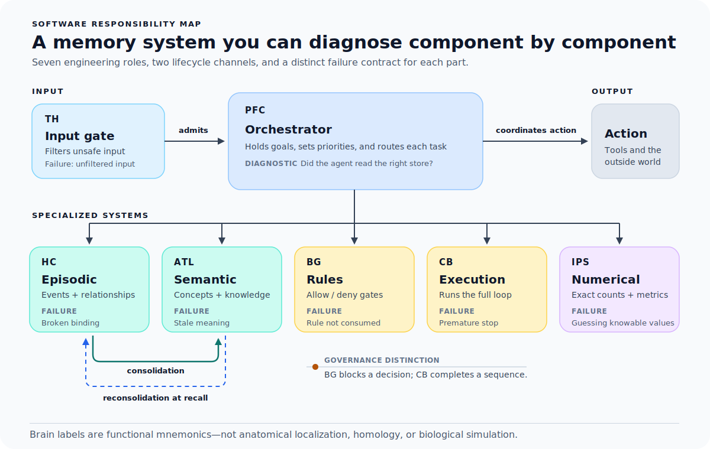

# 01 — The Mapping

> Human memory depends on partially dissociable but interacting systems. This
> document uses selected brain functions as mnemonic anchors for software
> contracts so that agent failures can be classified component by component. It
> is not a one-to-one anatomical model, a biological simulation, or a claim of
> homology.

The machine-readable component/channel ontology lives in
[`schema/brain_components.yaml`](../schema/brain_components.yaml). This file adds
the narrative *why* and states where the public runtime implements a narrower
contract than the broader engineering analogy.

The map spans five memory responsibilities, two control responsibilities, and
two lifecycle channels. In the public package, differentiated stores, scoped
recall, explicit lifecycle records, and checkpoints form the memory-management
kernel. Its local proposed-action gate and command-execution helpers are
optional downstream consumers of those memory contracts. A host can use the
memory kernel—including procedural memory—without delegating command execution
to Brain-AI, and connecting MCP alone does not make any control verdict enforced.



## Why a mapping at all

The usual way an agent "has memory" is a pile of mechanisms that grew one at a time: a vector
store for retrieval, a scratchpad for the current task, a context window that silently drops the
oldest tokens, maybe a JSON file of facts. Each was added to fix a specific pain. None of them
answers the structural question: *given a piece of information, which store should hold it, and
when should it move?*

When something goes wrong (the agent repeats a question it already answered, cites a source it
half-remembers, miscounts a list, gives up on a multi-step task halfway) you have no vocabulary
to say *which* part broke. "The memory failed" is as useless as a doctor saying "the brain is
sick."

Neuroscience suggests that memory and control rely on interacting circuits with
different computational biases and failure profiles. We borrow that functional
differentiation as an engineering heuristic. “PFC,” “HC,” and the other labels
below name software responsibilities; they do not imply that a brain region is a
self-contained box or that the implementation reproduces its biology. Each
mapping therefore separates the neuroscience inspiration, the software
contract, and the deliberate engineering divergence. The mapping earns its
place only if it makes agent failures easier to name, test, and repair.

## Mechanisms are not the architecture

This mapping does not replace RAG, hooks, harnesses, or loops. It assigns them
different jobs:

- **RAG or a vector store** retrieves candidate knowledge.
- **A hook** provides a moment when the system can inspect or intercept an
  event.
- **A guard** makes a single allow/deny decision at that moment.
- **A harness** owns a multi-step sequence and its fallback paths.
- **A loop** feeds an outcome or verdict back into another attempt.

Those mechanisms can be combined without a memory architecture, but the result
is often a pile of fixes with no answer to four questions: which subsystem owns
the information, how that subsystem fails, when the information should change
form, and whether the feedback path is actually closed. The mapping supplies
that diagnostic contract. Its claim is not that the mechanisms are new; it is
that keeping their responsibilities and failure modes separate makes the whole
system easier to operate.

## The seven engineering roles and two lifecycle channels

This is a software responsibility map, not an anatomical or connectivity
diagram.

```
                          ┌─────────────────────────────┐
                          │   PFC — Orchestrator         │
                          │   routes work to the right   │
                          │   store; sets priorities     │
                          └───────────────┬─────────────┘
                                          │ routes to
        ┌────────────────┬────────────────┼────────────────┬────────────────┐
        ▼                ▼                ▼                 ▼                ▼
  ┌───────────┐   ┌────────────┐   ┌────────────┐   ┌────────────┐   ┌───────────┐
  │ HC        │   │ ATL        │   │ BG         │   │ CB         │   │ IPS       │
  │ episodic  │   │ semantic   │   │ rules      │   │ execution  │   │ numerical │
  │ (events,  │   │ (concepts, │   │ (allow /   │   │ (run the   │   │ (exact    │
  │  entities)│   │  facts)    │   │  deny)     │   │  loop)     │   │  counts)  │
  └─────┬─────┘   └─────┬──────┘   └────────────┘   └────────────┘   └───────────┘
        │               │
        │ consolidation │           ┌────────────────────────────────────────┐
        └──────────────►│           │ TH — proposed-action gate: evaluates    │
        (episode →      │           │ an explicit action before execution     │
         knowledge)     │           └────────────────────────────────────────┘
        ◄───────────────┘
         reconsolidation
        (explicit versioned update after conflict)
```

In this implementation, the BG- and TH-inspired software roles contribute to one
deterministic proposed-action verdict. That determinism is an engineering
property of the rule matcher, not a claim that the basal ganglia or thalamus are
simple Boolean valves. The bundled CLI harness consumes that verdict before its
own subprocess call; an external host must wire and consume the verdict itself.
The rest depend on orchestrator judgment and stay partly open. Keep that
software asymmetry in mind; it is revisited at the end.

---

### PFC — the Orchestrator

**Neuroscience inspiration.** Prefrontal regions contribute to maintaining
goals and task rules and to biasing processing across distributed
cortical-subcortical networks. Executive control is not localized to one PFC
“executive,” and prefrontal cortex also participates in working-memory
representation.

**Agent analog.** The host agent loop and its routing logic. Given a request, an
orchestrator decides: is this a fact to look up (semantic), a selected past
event to recall (episodic), a rule to inspect (procedural), or a number to read
exactly (numerical)? The public runtime implements a small, auditable routing
heuristic for recall; it does not replace the host's full executive loop.

**Engineering divergence.** A software orchestrator exposes explicit routes,
state, and traces. Biological cognitive control is distributed and adaptive,
not a deterministic dispatcher.

**Failure mode.** *Misrouting.* The capability exists but is misapplied: the
agent estimates a number it could have looked up, or answers from the context
window something that belonged in long-term store. This is a software routing
failure, not a clinical equivalence.

**Diagnostic.** Trace a single decision. Which store did the agent actually read, and was that the
right one for this kind of question? Most "memory bugs" are really routing bugs.

---

### HC — Episodic memory (the hippocampus)

**Neuroscience inspiration.** The hippocampal formation and wider
medial-temporal/cortical network rapidly bind relations among elements of an
experience and its context, supporting later reinstatement. Treating the
hippocampus as an index to distributed cortical representations is an
influential theory, not a literal file-index account.

**Agent analog.** The selected-event log and entity graph: append-only records
that a host or operator explicitly writes, plus relationships between the
entities involved (this person, that decision, this thread). It is *contextual*
memory, tied to a recorded circumstance, unlike semantic memory. The public
runtime does not automatically ingest or preserve provider transcripts.

**Engineering divergence.** Append-only records, stable IDs, an ingest
timestamp, and a source label are software guarantees. Evidence-grade
provenance—such as provider session/message IDs or a raw-evidence hash—must be
supplied and retained by the host. Biological episodic memory is reconstructive
and transformable, not an immutable event log.

**Failure mode.** *Broken binding.* The agent acts on a stale prior, re-asks a
settled question, or fails to connect two events that belong together because
the contextual record is missing, ambiguous, or linked incorrectly.

**Diagnostic.** When the agent recalls a selected event, are its entity binding,
source label, and ingest timestamp intact, or did the host stitch together a
plausible but false link? If occurrence time or a provider message is material,
the host must preserve that evidence outside the current event fields.

---

### ATL — Semantic memory (the anterior temporal lobe)

**Neuroscience inspiration.** Bilateral anterior temporal regions are proposed
to act as a transmodal hub within a distributed semantic system.
Modality-specific representations and semantic control also depend on wider
temporal, frontal, and parietal networks; the ATL is not the sole place where
facts “live.”

**Agent analog.** A source-labeled concept/fact store over notes, documents, and
references, optionally indexed with embeddings or lexical retrieval. This is
where reusable knowledge lives independently of any one session. The source
field is useful audit metadata, not a complete evidence-provenance system.

**Engineering divergence.** A vector index is not a neural homologue. The public
runtime preserves source labels and explicit supersession links; freshness and
conflict detection remain host/operator responsibilities.

**Failure mode.** *Meaning errors and staleness.* Misreading a concept,
following a dangling link, treating a secondary source as primary, or repeatedly
returning an outdated view from a fossilized index.

**Diagnostic.** Is the retrieved knowledge both *relevant* and *fresh*? Did the agent verify a
cited claim against the primary source, or just trust the embedding's nearest neighbor?

---

### BG — Procedural-rule memory (the basal ganglia)

**Neuroscience inspiration.** Cortico-basal-ganglia-thalamo-cortical circuits
contribute to learned action selection, reinforcement and habit learning, and
gating of motor and cognitive representations. Their operation is
context-dependent and adaptive, not a deterministic Boolean rule.

**Agent analog.** Rule memory in two forms: *static* (instructions and stored
rules an agent can retrieve) and *dynamic* (a deterministic check over an
explicit proposed-action string). A dynamic verdict stops an action only when
the bundled CLI harness or an integrating host consumes it before execution.

**Engineering divergence.** Deterministic pre-action guards deliberately
harden the gating metaphor into an auditable software policy.

**Failure mode.** *Policy enforcement failure.* A declared policy is not
enforced at action time, or a guard blocks or allows the wrong case.

**Diagnostic.** For each rule you care about, is there a deterministic gate that
is called with the relevant action and entity, and does the executor consume its
verdict? A stored rule without that wiring is recallable policy, not enforced
control.

---

### CB — Procedural-execution (the cerebellum)

**Neuroscience inspiration.** Cerebellar circuits contribute to prediction,
timing, coordination, and error-based adaptation through cerebro-cerebellar
loops in motor and some cognitive domains. Evidence for sequence processing
does not make the cerebellum a general-purpose workflow runner.

**Agent analog.** An executable harness: code that owns an explicit command
sequence and its host-supplied fallback paths. The bundled optional control bridge
can run one local command or try a finite list until one succeeds, is blocked, or
the list is exhausted. It does not take over arbitrary host workflows.

**Engineering divergence.** The harness borrows prediction, correction, and
fluent sequencing as design motifs. Ownership of an arbitrary fallback workflow
through completion is a software extension, not a proposed cerebellar mechanism.

**Failure mode.** *Premature abandonment.* The agent recalls the procedure,
tries the first path, hits a snag, and gives up before the registered alternatives
are exhausted.

**Diagnostic.** Is the multi-step fallback externalized as code that runs to completion, or
re-described by the model each time? This is the single most common place where a capable agent
*looks* like it failed when really it just stopped early.

**Why it is separate from BG.** Both are "procedural," but BG enforces a single allow/deny
*decision* while CB executes a *sequence with fallbacks*. They fail differently and are fixed
differently (a guard vs. a harness), so collapsing them hides the distinction that matters.
This BG/CB separation is an engineering decomposition; the biological systems
interact within integrated networks.

---

### IPS — Exact numerical state and computation (the intraparietal sulcus)

**Neuroscience inspiration.** The intraparietal sulcus is consistently involved
in quantity and magnitude processing, including approximate number
representation and some online calculation. Exact verbal arithmetic and
arithmetic-fact retrieval recruit broader parietal, language, memory, and
frontal networks.

**Agent analog.** A small queryable exact-state store for values the agent must
not estimate: counts, totals, and metrics with a knowable correct value. The
stored value is part of the public data plane; the IPS label denotes the
relational/numerical control responsibility, not a claim that IPS is a separate
long-term memory system.

**Engineering divergence.** The exact numerical store is a deliberate
complement, not a replica: because neural and model magnitude representations
can be approximate, exact values are delegated to a queryable source of truth.

**Failure mode.** *Estimation where the answer was knowable.* “About a dozen
items” when the real count was eleven and readable from an authoritative source.

**Diagnostic.** Was every quantity in the output read from a source, or did some get estimated from
memory? Numbers in agent output should be sourced, not recalled.

---

### TH — Proposed-action gating (the thalamus)

**Neuroscience inspiration.** Thalamic nuclei relay and modulate signals and
help select, amplify, and coordinate task-relevant interactions within
distributed thalamocortical networks. The thalamus is neither a single
perimeter filter nor a biological security gateway.

**Agent analog.** A preventive check over a proposed action. The public runtime
matches an explicit action string against built-in and stored regular-expression
rules and returns allow, warn, or block. It does not inspect arbitrary prompts,
provider tool traffic, or deserialized payloads unless a host first maps those
actions into this contract.

**Engineering divergence.** The proposed-action gate deliberately translates
selective routing and gating into an auditable pre-execution policy decision.
The decision becomes a boundary only where an executor is wired to honor it.

**Failure mode.** *Under-gating* occurs when a relevant proposed action is not
checked, lacks a matching rule, or has a block verdict that the host ignores.
*Over-gating* occurs when a broad pattern rejects a legitimate action.

**Diagnostic.** Was the concrete proposed action and, when applicable, its
entity passed to the gate before execution? Did the executor treat a block as a
stop condition? A verdict that is merely returned as context has not closed the
control loop.

---

## The two channels

Components name responsibilities: memory components store or recall, while
control components route, compute, or decide. Channels *move or version stored
information*. These transfer mechanisms are where agent memory can quietly
break—not because a store is missing, but because nothing promotes or updates
what the stores hold.

### Consolidation — episodic evidence → derived knowledge or rule

**Neuroscience inspiration.** Systems consolidation refers to time-dependent
reorganization and transformation across hippocampal-cortical networks. Offline
replay and sleep can support it, but it is not simply a file transfer from
hippocampus to cortex, and whether detailed episodic memories remain
hippocampus-dependent is theory-dependent.

**Agent translation.** The public runtime can preview and explicitly apply a
promotion from one selected episode into a semantic record or a rule whose
regular-expression pattern was already supplied. It retains the source event
and records a source link plus lifecycle audit. It neither groups multiple
episodes into a new abstraction nor schedules promotion automatically. Thus
episodic → semantic is a lifecycle primitive, not a claim to reproduce
biological systems consolidation. **If a host never invokes this channel**,
retrieval can return raw episodes without producing reusable lessons, and the
agent may re-derive the same insight repeatedly.

### Reconsolidation — explicit versioned update after conflict is identified

**Neuroscience inspiration.** Reactivation can, under some conditions,
destabilize a consolidated memory and require restabilization. Not every
retrieval opens a memory for change; memory age, strength, prediction error, and
reactivation conditions impose boundaries.

**Agent translation.** The public runtime provides an explicit supersede
operation that creates a new semantic record linked to the prior record and
marks the prior record superseded rather than rewriting it in place. Retrieval
does not currently detect conflict or trigger that operation automatically; the
host or operator must decide when to call it. This versioned update primitive is
an engineering adaptation, not a biological reconsolidation model.

---

## The asymmetry you should not forget

It is tempting to read this mapping as "wire up seven components and two channels and the agent
runs itself." It does not work that way, and the honest version of the map says so.

Within this software implementation, the BG- and TH-inspired matcher produces a
deterministic verdict. The local CLI harness closes that narrow loop for the
subprocesses it starts, including entity-scoped policies when `--entity` is
supplied. MCP exposes the same verdict but does not force unrelated host tools
to consume it, so MCP connection alone is advisory. Other components
remain partly judgment-dependent. This contrast describes the implementation,
not the determinism of the corresponding biological circuits. The host's
routing, the decision to verify a citation, and the choice to look up a number
instead of estimating it can still depend on judgment *in the moment*.

That asymmetry is not a gap to be closed; it is the shape of the problem. Mapping the brain does
not make a hard problem deterministic. What it does is tell you **which parts are deterministic and
which are not**, so you stop trying to hook your way out of a judgment problem, and stop trusting
judgment where a hook would do.

The rest of this repo builds on that line: [`02-memory-lifecycle.md`](02-memory-lifecycle.md) for
how entries move and age, [`03-governance-tiers.md`](03-governance-tiers.md) for the deterministic
vs. advisory split and why catching a mistake is not the same as preventing it, and
[`04-principles.md`](04-principles.md) for the short rule set that lives in the open, judgment-bound
parts.

## Neuroscience grounding and limits

These sources ground the functional inspirations and, equally importantly,
their limits:

- distributed prefrontal cognitive control: [Menon,
  2021](https://pmc.ncbi.nlm.nih.gov/articles/PMC8616903/);
- hippocampal indexing and relational/contextual coding: [Teyler & Rudy,
  2007](https://pubmed.ncbi.nlm.nih.gov/17696170/) and [Sugar & Moser,
  2019](https://pubmed.ncbi.nlm.nih.gov/31334573/);
- semantic cognition as a distributed hub-and-control system: [Lambon Ralph et
  al., 2017](https://pubmed.ncbi.nlm.nih.gov/27881854/);
- basal-ganglia gating and integrated basal-ganglia/cerebellar networks: [Frank,
  2011](https://pubmed.ncbi.nlm.nih.gov/21498067/) and [Bostan & Strick,
  2018](https://pubmed.ncbi.nlm.nih.gov/29643480/);
- cerebellar prediction and cognitive loops: [Sokolov et al.,
  2017](https://pmc.ncbi.nlm.nih.gov/articles/PMC5477675/);
- approximate versus exact numerical cognition: [Dehaene et al.,
  2003](https://pubmed.ncbi.nlm.nih.gov/20957581/) and [Lemer et al.,
  2003](https://pubmed.ncbi.nlm.nih.gov/14572527/);
- thalamic selection and cognitive control: [Halassa & Kastner,
  2017](https://pubmed.ncbi.nlm.nih.gov/29184210/);
- systems consolidation and memory transformation: [Squire et al.,
  2015](https://pubmed.ncbi.nlm.nih.gov/26238360/) and [Winocur et al.,
  2010](https://pubmed.ncbi.nlm.nih.gov/26726963/); and
- reconsolidation and its boundary conditions: [Nader & Hardt,
  2009](https://pubmed.ncbi.nlm.nih.gov/19229241/) and [Auber et al.,
  2013](https://pmc.ncbi.nlm.nih.gov/articles/PMC3650827/).
